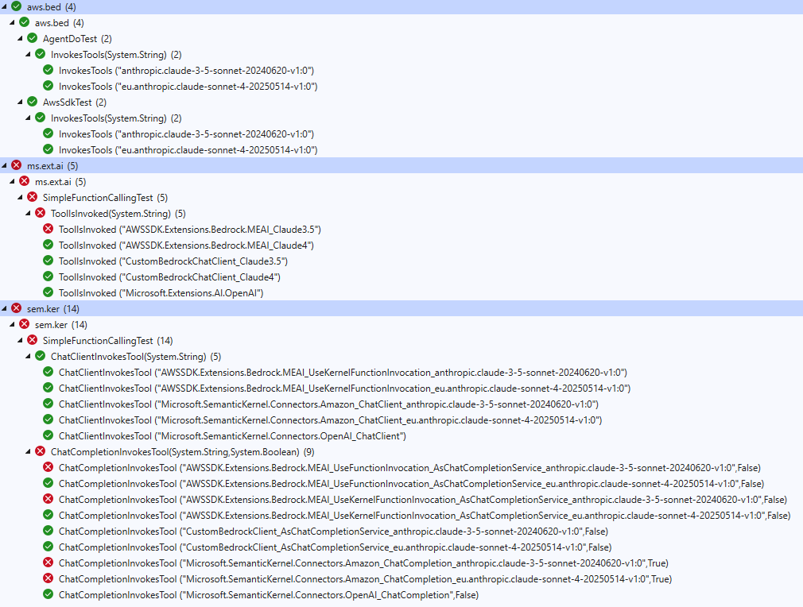

# Dotnet Agent Experiments

I am experimenting with differnt agent patterns in dotnet.

## Basic Function Calling

Lets compare different options for function calling with Amazon Bedrock:

- AWSSDK.BedrockRuntime
- AgentDo
- Microsoft.Extensions.AI & AWSSDK.Extensions.Bedrock.MEAI
- Microsoft.SemanticKernel & Microsoft.SemanticKernel.Connectors.Amazon

### Results



## Semantic Kernel

> [!WARNING]  
> With the advent of [Microsoft Agent Framework](https://github.com/microsoft/agent-framework) (building on MEAI), Semantic Kernel does not have a future!

There seems to be an issue regarding [#11448 .Net: Support Function calling for Amazon Bedrock (Using Converse APIs)](https://github.com/microsoft/semantic-kernel/issues/11448). The recommendation seems to be to use `IChatClient` instead of `IChatCompletionService`. And I actually got function calling working with like this:

```csharp
var kernel = serviceScope.ServiceProvider.GetRequiredService<Kernel>();
var chatClient = kernel.GetRequiredService<IChatClient>();

List<ChatMessage> chatHistory = [];
chatHistory.Add(new ChatMessage(ChatRole.System, "You are a helpful AI assistant"));
chatHistory.Add(new ChatMessage(ChatRole.User, "Do I need an umbrella?"));

var invocation = chatClient.GetStreamingResponseAsync(
    messages: chatHistory,
    options: new()
    {
        Temperature = 0f,
        Tools = [AIFunctionFactory.Create([Description("Get the current weather.")]() => kernel.GetRequiredService<WeatherInformation>().GetWeather())]
    });
await foreach (var update in invocation)
{
    Console.Write(update);
}
```

However it feels less well integrated:

1. `ChatHistory` is not updated automatically, but messages need to be maintained manually.
2. Tools are not picked up automatically from plugins but have to be provided again.

There seems to be interoperability method available with `chatClient.AsChatCompletionService();`, but this breaks function calling again.

It seems that with `IChatCompletionService` my tools / plugins do not get picked up when used with AWS Bedrock.

Bedrock is also not on the offical list of function calling support:

<https://learn.microsoft.com/en-us/semantic-kernel/concepts/ai-services/chat-completion/function-calling/function-choice-behaviors?pivots=programming-language-csharp#supported-ai-connectors>

### Adapter by Johnny Z

According to [AWS Bedrock anthropic claude tool call integration with microsoft semantic kernel](https://dev.to/stormhub/aws-bedrock-anthropic-claude-tool-call-integration-with-microsoft-semantic-kernel-29g3) a custom implementation can adapt the AWSSDK.BedrockRuntime IChatClient, like [resources/2025-04-02/ConsoleApp/ConsoleApp/AnthropicChatClient.cs](https://github.com/StormHub/stormhub/blob/main/resources/2025-04-02/ConsoleApp/ConsoleApp/AnthropicChatClient.cs). The implementation reminds me of [AgentDo](https://github.com/halllo/AgentDo), but seems more comprehensive.

It is set up like this:

```csharp
services.AddKeyedSingleton<IChatCompletionService>("anthropic.adapter", (sp, key) =>
{
    var runtime = sp.GetRequiredService<IAmazonBedrockRuntime>();
    IChatClient client = new AnthropicChatClient(runtime, "anthropic.claude-3-5-sonnet-20240620-v1:0");
#pragma warning disable SKEXP0001 // Type is for evaluation purposes only and is subject to change or removal in future updates. Suppress this diagnostic to proceed.
    IChatCompletionService chatCompletionService = client
        .AsBuilder()
        .UseFunctionInvocation()
        .Build()
        .AsChatCompletionService();
#pragma warning restore SKEXP0001 // Type is for evaluation purposes only and is subject to change or removal in future updates. Suppress this diagnostic to proceed.

    return chatCompletionService;
});
```

It successfully invokes my tools / plugins.
